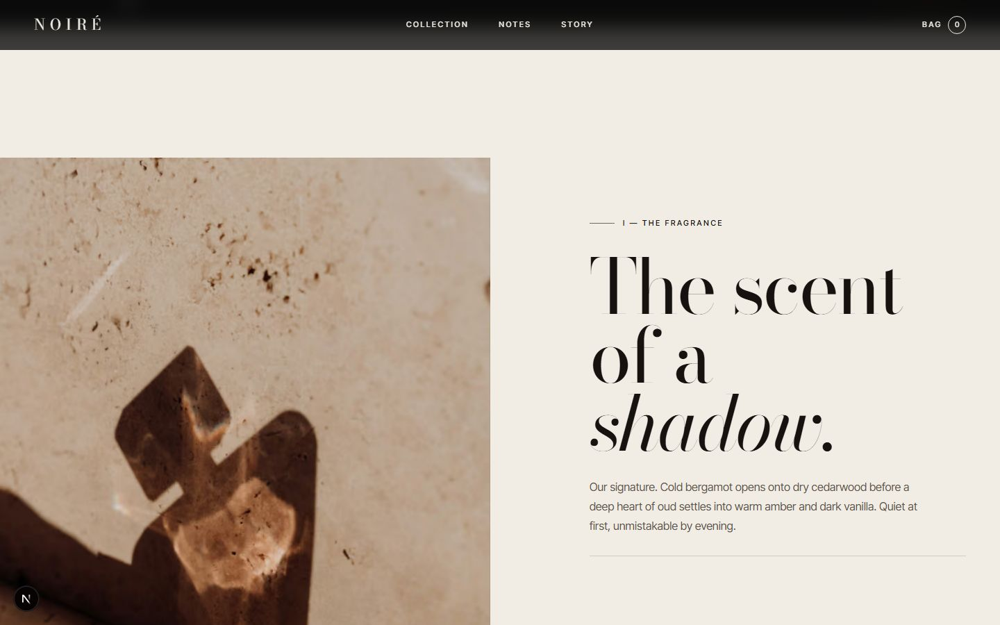
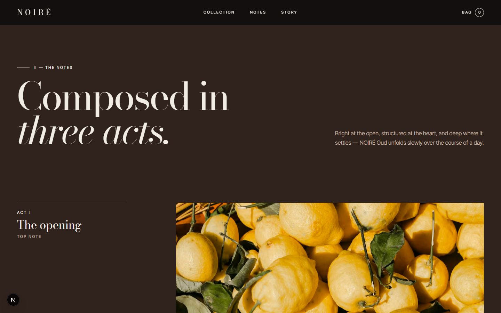
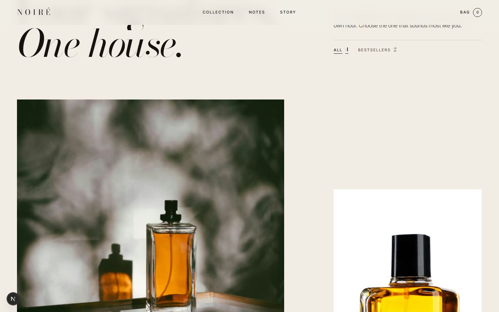
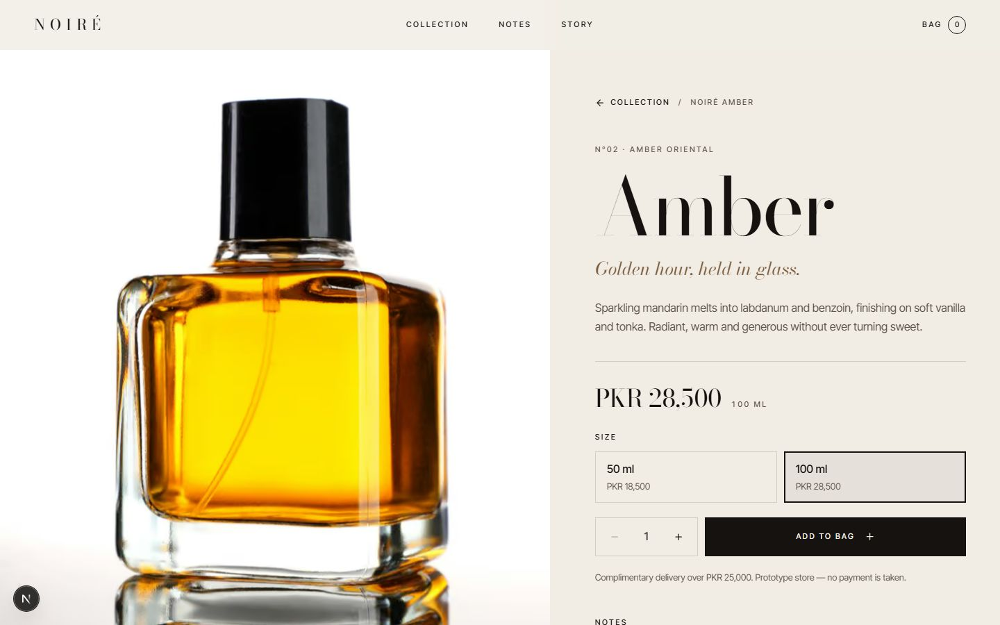
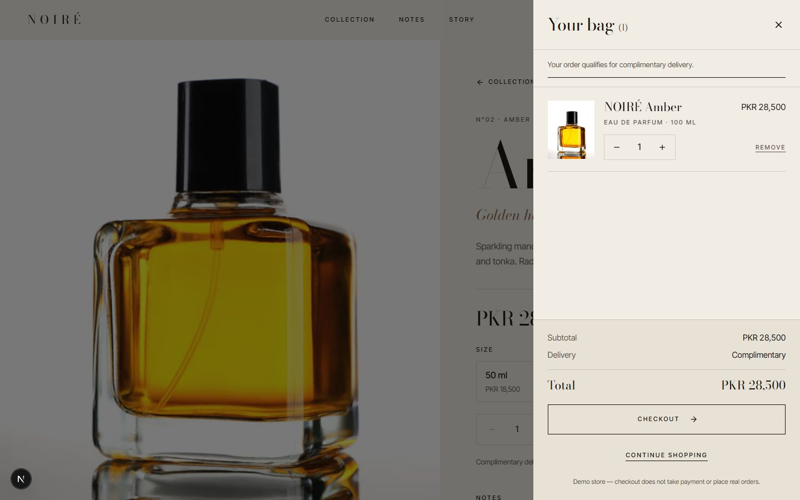
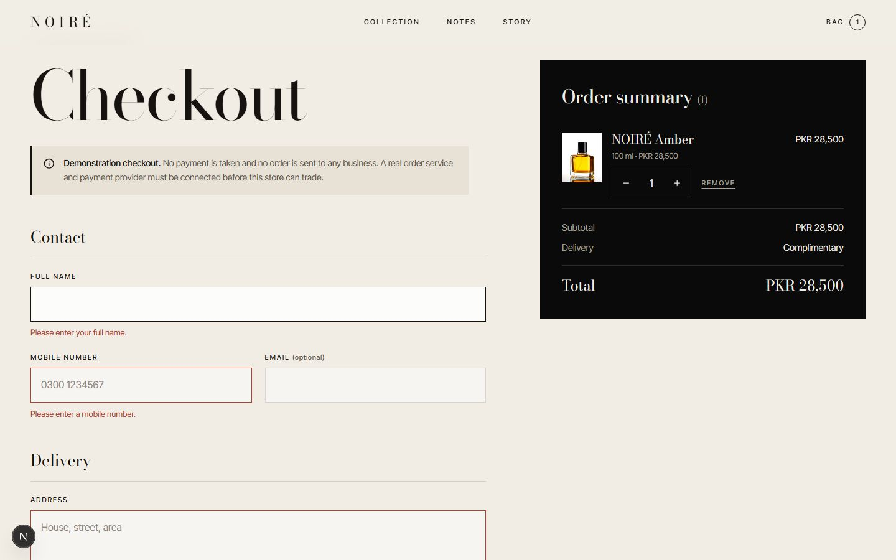
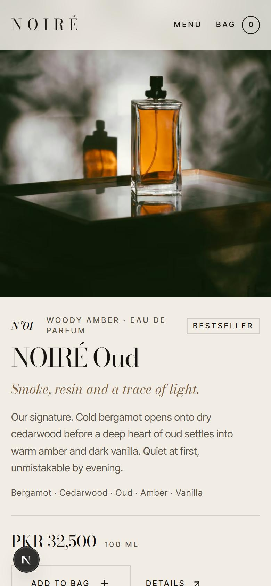

<div align="center">

# NOIRÉ

### An art-directed luxury fragrance storefront

A fully shoppable e-commerce front end for a **fictional** perfume house, designed to feel like an international fragrance campaign rather than a template store.

**[🌐 Live demo](https://usman552.github.io/noire-fragrance/)** · **[Product page](https://usman552.github.io/noire-fragrance/fragrances/noire-oud/)** · **[Checkout](https://usman552.github.io/noire-fragrance/checkout/)**


</div>

> NOIRÉ is a made-up brand and this is a design and engineering prototype. **Checkout is a demonstration: no payment is taken and no order is sent anywhere.**

---

## Table of contents

- [Overview](#overview)
- [Screenshots](#screenshots)
- [Features](#features)
- [Pages](#pages)
- [Tech stack](#tech-stack)
- [Technical highlights](#technical-highlights)
- [Getting started](#getting-started)
- [Project structure](#project-structure)
- [Testing and CI/CD](#testing-and-cicd)
- [Design system](#design-system)
- [Photography and licensing](#photography-and-licensing)
- [Going to production](#going-to-production)
- [Known limits](#known-limits)

## Overview

The brief was to move away from generic e-commerce visuals and build something with the creative direction, typography and composition of a fragrance advertising campaign, without losing real shopping functionality.

The site follows light through a day, an idea called **"The hour after"**: ivory stone by daylight, espresso at dusk, obsidian after dark. Every photograph is about light falling on something, and each section sits in its own environment, so scrolling feels like moving between rooms.

## Screenshots

| Hero | The fragrance |
| --- | --- |
|  |  |

| The notes | Collection |
| --- | --- |
|  |  |

| Brand story | Product page |
| --- | --- |
|  |  |

| Cart drawer | Checkout validation |
| --- | --- |
|  |  |

**Mobile** (composed separately, not shrunk from desktop)

<p>
  
  &nbsp;&nbsp;
  
</p>

## Features

### Storefront
- Editorial home page: hero, fragrance introduction, three-act notes, immersive campaign scene, collection, brand story and closing
- Four fragrances (Oud, Amber, Velvet, Intense), each shown in its own composition rather than a repeated card
- Collection filter (All / Bestsellers)
- Statically generated product pages with notes, details, an atmosphere band, ingredient photography and related products
- Photography credits page

### Shopping
- Add to bag from the home page, collection and product pages
- Size selection (50 ml / 100 ml) with per-size pricing
- Quantity steppers (1 to 10) in the cart and at checkout
- Cart drawer: update quantity, remove, subtotal, delivery and total, free-delivery progress, empty state
- Cart persisted in `localStorage` (versioned, sanitised, synced across tabs)
- Checkout with validation for name, Pakistani mobile number (normalised to `+92…`), optional email, address and city
- Live order summary, demo order service and confirmation receipt
- Clear "demonstration only" messaging throughout checkout

### Experience
- Short hero entrance, clip-path image reveals, masked headline lines, restrained parallax and one scroll-scrubbed campaign reveal
- Header that detects the background under it and switches between light and dark ink
- Full-screen mobile menu
- Fully responsive with separate mobile compositions and no horizontal overflow

## Pages

| Route | Description |
| --- | --- |
| [`/`](https://usman552.github.io/noire-fragrance/) | Home: hero, introduction, notes, campaign, collection, story, closing |
| [`/fragrances/noire-oud`](https://usman552.github.io/noire-fragrance/fragrances/noire-oud/) | NOIRÉ Oud: Woody Amber, Eau de Parfum |
| [`/fragrances/noire-amber`](https://usman552.github.io/noire-fragrance/fragrances/noire-amber/) | NOIRÉ Amber: Amber Oriental, Eau de Parfum |
| [`/fragrances/noire-velvet`](https://usman552.github.io/noire-fragrance/fragrances/noire-velvet/) | NOIRÉ Velvet: Floral Musk, Eau de Parfum |
| [`/fragrances/noire-intense`](https://usman552.github.io/noire-fragrance/fragrances/noire-intense/) | NOIRÉ Intense: Leather Woody, Extrait de Parfum |
| [`/checkout`](https://usman552.github.io/noire-fragrance/checkout/) | Contact, delivery and demo payment form with live order summary |
| `/checkout/confirmation` | Demo order receipt (shown after placing an order) |
| [`/credits`](https://usman552.github.io/noire-fragrance/credits/) | Photography credits |

## Tech stack

| Area | Choice |
| --- | --- |
| Framework | Next.js 16 (App Router, static generation), React 19 |
| Language | TypeScript (strict) |
| Animation | GSAP 3 + ScrollTrigger, via `gsap.matchMedia` |
| Styling | CSS Modules + a small global design system |
| Icons | lucide-react |
| Images | `next/image` with static imports |
| Fonts | Bodoni Moda (display) and Inter Tight (text) via `next/font` |
| Tests | Node's built-in test runner |
| CI/CD | GitHub Actions to GitHub Pages |

## Technical highlights

**Pure, testable commerce logic.** The cart is a plain reducer with no React or browser APIs. It stores only `{ productId, sizeId, quantity }` and re-prices from the catalogue on every read, so stale `localStorage` can never show an outdated price. Storage is versioned and sanitised against corrupt or hostile data.

**Swappable backend.** The UI talks to an `OrderService` interface, and the catalogue is a single module. Connecting a real API and payment provider means implementing one function and one fetch, with no UI changes.

**Animation that cannot break the shop.** All GSAP set-up runs through `gsap.matchMedia`, so it rebuilds on resize and reverts on unmount. If set-up ever throws, the page falls back to static, fully visible content. Reveals animate opacity only (never `visibility`), so unrevealed content stays focusable and in the accessibility tree, and focusing inside a pending reveal completes it instantly.

**Accessibility.** Skip link, labelled controls, focus-trapped cart drawer with Escape and focus return, live-region cart announcements, visible focus styles, 44px touch targets, and full `prefers-reduced-motion` support (no intro, no scroll choreography, all content visible).

**Performance.** Hero and product photographs are preloaded, everything else is lazy. Images have intrinsic sizes and blur placeholders (no layout shift) and honest `sizes` hints. Animations touch transforms, opacity and clip-path only. There is no WebGL and no smooth-scroll library. Every route is prerendered as static HTML.

**Environment-based theming.** Each section declares `theme-dark | theme-light | theme-espresso | theme-stone`. Components read only `--bg / --fg / --fg-soft / --rule / --accent`, so any block looks right in any environment, and the header samples the environment beneath it.

**Central asset registry.** Every image goes through `lib/assets.ts`, which holds the file, alt text, focal point per breakpoint and credit. Swapping a photograph, or dropping in a real product shoot, is a one-entry change.

## Getting started

**Requirements:** Node.js 22.6 or newer, and npm.

```bash
git clone https://github.com/Usman552/noire-fragrance.git
cd noire-fragrance
npm install
npm run dev
```

Open <http://localhost:3000>.

| Script | Purpose |
| --- | --- |
| `npm run dev` | Start the development server |
| `npm run build` | Production build |
| `npm start` | Serve the production build |
| `npm run typecheck` | TypeScript check |
| `npm test` | Unit tests |

### Build the GitHub Pages version locally

```bash
# macOS / Linux / Git Bash
GITHUB_PAGES=true npm run build
```

```powershell
# Windows PowerShell
$env:GITHUB_PAGES="true"; npm run build
```

This produces a static export in `out/` served under `/noire-fragrance`.

## Project structure

```text
app/                      Routes (App Router)
  page.tsx                Home: composes the sections
  fragrances/[slug]/      Product detail (static generation)
  checkout/               Checkout and confirmation
  credits/                Photography credits
components/
  home/                   Hero, Introduction, Notes, Campaign, Collection, BrandStory, Closing
  product/  checkout/     Product detail, add-to-bag, checkout views
  layout/                 Header, Footer, CartDrawer
  ui/                     Photo, MaskedLines, QuantityStepper
lib/
  products.ts             Catalogue: single source of truth
  assets.ts               Photography registry
  cart/                   Reducer and totals, localStorage adapter, React provider
  checkout/validation.ts  Form rules and phone normalisation
  orders/orderService.ts  OrderService interface and demo implementation
  motion.ts               GSAP setup and reveal helpers
public/images/            Photography
docs/screenshots/         README images
tests/                    Unit tests
.github/workflows/        Pages deployment
```

## Testing and CI/CD

`npm test` covers cart merging, size separation, quantity clamping, totals and the free-delivery threshold, corrupt-storage recovery, phone normalisation, checkout validation, receipt snapshots and catalogue integrity.

Every push to `main` triggers a GitHub Actions workflow that installs dependencies, runs the tests, builds the static export, type-checks, and deploys to GitHub Pages. In addition, the full shopping flow (size, quantity, add, update, remove, persistence across reload, validation, order and confirmation) was exercised in a real browser at desktop and mobile widths.

## Design system

| Token | Value | Use |
| --- | --- | --- |
| Obsidian | `#0A0A0A` | Dark campaign scenes |
| Ivory | `#F1EDE5` | Daylight sections, product and checkout |
| Espresso | `#30221C` | Dusk: the notes |
| Stone | `#D9D2C6` | The brand story |
| Bronze | `#987653` family | Italic emphasis only |

Display type is **Bodoni Moda** (a high-contrast fashion serif with an optical-size axis), used large and selectively. Body and labels use **Inter Tight**.

## Photography and licensing

All 21 photographs are from [Unsplash](https://unsplash.com) and used under the [Unsplash License](https://unsplash.com/license) (free for commercial use, attribution not required). Each was confirmed to be a free photo rather than Unsplash+, and the bottles were checked for visible brand marks. Photographers are credited on the [`/credits`](https://usman552.github.io/noire-fragrance/credits/) page.

The bottles are unbranded stock photographs standing in for NOIRÉ's fictional products. They are not products of the photographers or of any real fragrance house.

## Going to production

1. Implement `OrderService.submit()` against a real API and payment provider and change the `orderService` export in `lib/orders/orderService.ts`.
2. Replace `lib/products.ts` with a data fetch that returns the same `Product` shape.
3. Optionally replace `lib/cart/storage.ts` with a server-backed cart.
4. Replace the stock bottle photographs in `lib/assets.ts` with a real product shoot.

## Known limits

- Prices, the delivery policy (free over PKR 25,000, otherwise PKR 350) and all copy are placeholders.
- The bottle photographs are different stock images, so the collection hangs together through framing and art direction rather than one consistent bottle. A dedicated shoot would fix that.
- On the static GitHub Pages build there is no image optimiser, so images are served as pre-sized files from `public/images`.
